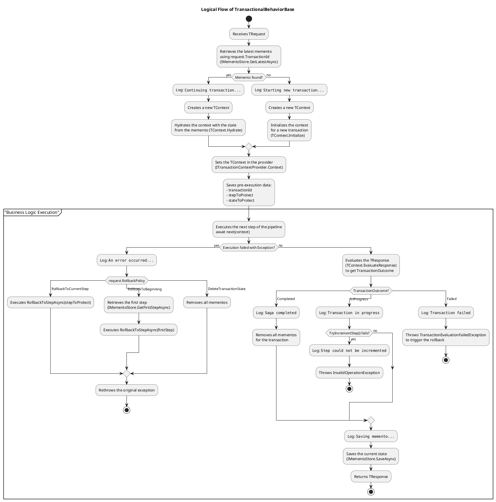

# TransactR
[](https://github.com/lucafabbri/TransactR/actions) [](https://github.com/lucafabbri/TransactR/releases) [](https://www.nuget.org/packages/TransactR)

A lightweight .NET library for building reliable, stateful, and multi-step operations using the Memento pattern.

## 🤔 Why TransactR?

Modern applications often deal with complex business processes that span multiple service calls or user interactions. Managing the state of these operations and ensuring data consistency in case of failure can be challenging.

**TransactR** simplifies this by providing a transactional layer for your command pipeline (like MediatR or Concordia.Core). It allows you to:

* **Implement Sagas**: Easily build long-running processes where state is preserved between steps.

* **Prevent Inconsistent Data**: Automatically roll back to a previous valid state when an operation fails, whether due to a system exception or a business logic failure.

* **Decouple State Management**: Keep your business logic clean by abstracting away the persistence and restoration of state.

## ✨ Features

* **State Management with Memento Pattern**: Captures an object's state to allow for later restoration.

* **Transactional Pipeline Behavior**: Intercepts command processing to orchestrate state saving, execution, and rollback.

* **Pluggable Storage**: Abstracted persistence via `IMementoStore` with multiple backends (Entity Framework, MongoDB, Redis, etc.).

* **Custom Rollback Logic**: Define how to restore state when an operation fails using `IStateRestorer`.

* **Interactive Saga Support**: Maintains transaction state across multiple requests.

* **Flexible Outcome Evaluation**: Determines transaction outcome by evaluating the handler's response, not just by catching exceptions.

* **Configurable Disaster Recovery**: Offers fine-grained rollback policies (`RollbackToCurrentStep`, `RollbackToBeginning`, `DeleteTransactionState`).

* **Per-Request Rollback Policies**: Override the default rollback behavior directly on your request object.

## ⚙️ How It Works

1. A command implementing `ITransactionalRequest` enters the pipeline.

2. The `TransactionalBehavior` intercepts it.

3. It retrieves the transaction's current state from the `IMementoStore` using the `TransactionId`.

4. It creates a `TransactionContext` containing the state.

5. The business logic is executed in the command handler, which returns a response.

6. The `TransactionContext` evaluates the response. If the outcome is `Failed`, or if an unhandled exception occurs, a rollback is triggered.

7. The `IStateRestorer` is invoked to restore the previous state based on the configured `RollbackPolicy`.

8. The final state is persisted back to the `IMementoStore` if the transaction is still in progress.

## 🚀 Getting Started: Example with MediatR

Here is a complete example of how to configure and use TransactR.

### 1. Define State and Response

First, define the objects for your transaction's state and the response from your handler.

```
// The state object that will be saved and restored.
public class MyState
{
    public int Value { get; set; }
}

// The response from your handler.
public class MyResponse
{
    public bool IsSuccess { get; set; }
}

```

### 2. Configure Dependency Injection

In your `Program.cs`, configure MediatR and TransactR using the new fluent API.

```
// Program.cs
var builder = WebApplication.CreateBuilder(args);

// 1. Add MediatR
builder.Services.AddMediatR(cfg => cfg.RegisterServicesFromAssembly(typeof(Program).Assembly));

// 2. Add TransactR with a fluent configuration
builder.Services.AddTransactR()
    .OnMediatR() // Use MediatR integration
        .HasState<MyState>()
            .PersistedInMemory() // Use the built-in in-memory memento store
            .RestoredBy<MyStateRestorer>() // Register your custom state restorer
            .UseContext<MyTransactionContext>()
                .Surround<MyCommand>(); // Apply transactional behavior to MyCommand

```

### 3. Define the Transactional Components

Create the command, the transaction context, and the state restorer.

```
// The command that initiates or continues the transaction.
public class MyCommand : IRequest<MyResponse>, ITransactionalRequest<MyState>
{
    public string TransactionId { get; set; }
}

// The context defines the transaction's workflow and outcome logic.
public class MyTransactionContext : TransactionContext<MyTransactionContext, MyState, MyResponse>
{
    // Logic to determine the transaction outcome based on the handler's response.
    public override TransactionOutcome EvaluateResponse(MyResponse response)
    {
        if (!response.IsSuccess)
        {
            return TransactionOutcome.Failed; // This will trigger a rollback.
        }
        
        // For multi-step sagas, you would update the state and return InProgress.
        return TransactionOutcome.Completed;
    }
}

// The logic to restore state in case of an error.
public class MyStateRestorer : IStateRestorer<MyState>
{
    public Task RestoreAsync(MyState state, CancellationToken cancellationToken)
    {
        // Your logic to revert changes in the database or other systems.
        Console.WriteLine($""Restoring state value to: {state.Value}"");
        return Task.CompletedTask;
    }
}

```

### 4. Implement the Command Handler

Inject the transaction context directly into your handler and implement your business logic.

```
public class MyCommandHandler : IRequestHandler<MyCommand, MyResponse>
{
    private readonly MyTransactionContext _context;

    public MyCommandHandler(MyTransactionContext context)
    {
        _context = context;
    }

    public Task<MyResponse> Handle(MyCommand request, CancellationToken cancellationToken)
    {
        _context.State.Value = 100;

        // If an exception is thrown, a rollback occurs.
        // If IsSuccess is false, a rollback also occurs based on EvaluateResponse.
        return Task.FromResult(new MyResponse { IsSuccess = true });
    }
}

```

### 5. Overriding the Rollback Policy

By default, a failure triggers a rollback to the current step (`RollbackToCurrentStep`). You can override this by implementing `ITransactionalRequestWithPolicy` on your command.

```
public class MyCommandWithPolicy : IRequest<MyResponse>, ITransactionalRequestWithPolicy<MyState>
{
    public string TransactionId { get; set; }

    // Specify a different policy, e.g., roll back to the very first step.
    public RollbackPolicy RollbackPolicy => RollbackPolicy.RollbackToBeginning;
}

```

## 🔧 Memento Store Implementations

TransactR is storage-agnostic. You can use an official implementation or create your own by implementing `IMementoStore`.

### TransactR.EntityFramework

* **Installation:** `dotnet add package TransactR.EntityFramework`

* **DI Integration:** `builder.Services.AddEntityFrameworkMementoStore<ApplicationDbContext, MyState, int>();`

### TransactR.DistributedMemoryCache

* **Installation:** `dotnet add package TransactR.DistributedMemoryCache`

* **DI Integration:** `builder.Services.AddDistributedMemoryCacheMementoStore<MyState, int>();`

### TransactR.MongoDB

* **Installation:** `dotnet add package TransactR.MongoDB`

* **DI Integration:** `builder.Services.AddMongoDbMementoStore<MyState, int>(...);`

### TransactR.AzureTableStorage

* **Installation:** `dotnet add package TransactR.AzureTableStorage`

* **DI Integration:** `builder.Services.AddAzureTableStorageMementoStore<MyState, int>(...);`

## Technical Deep Dive: TransactionalBehaviorBase

### 1. Objective & Architectural Patterns

The `TransactionalBehaviorBase` class is the core engine for a Saga pattern implementation, designed to manage long-running, distributed transactions that span multiple services or steps. It ensures resiliency and state consistency across the entire process.

It leverages several key design patterns:

* **Pipeline (Behavior) Pattern**: The class is structured to act as a middleware in a request pipeline (e.g., MediatR). The `Func<TContext, Task<TResponse>> next` delegate allows it to intercept a request, wrap it with transactional logic, and then pass control to the next component (the actual business logic handler).

* **Memento Pattern**: This is the foundation of the Saga's persistence and rollback capabilities. `IMementoStore` is responsible for creating and persisting snapshots (`mementos`) of the transaction's state (`TState`) at the end of each successful step. `IStateRestorer` uses these mementos to execute compensating actions and revert the system to a previous consistent state.

* **Strategy Pattern**: The `RollbackPolicy` enum is a classic implementation of the Strategy pattern. It decouples the failure recovery logic from the main flow, allowing the client (`ITransactionalRequest`) to specify at runtime how to handle exceptions (e.g., roll back the current step vs. the entire transaction).

* **Template Method Pattern**: The abstract `State<T>` class and its concrete implementations (`NumericState`, `StringState`, `EnumState`) define a common algorithm for state progression, while deferring the specific implementation of step increments/decrements to subclasses.

### 2. Core Components & Responsibilities

The system is composed of several decoupled components, each with a single responsibility:

* `IMementoStore<TState>`: **The State Persistence Layer.** This interface abstracts all storage operations for the transaction's state. Its implementation is responsible for saving, retrieving, and deleting mementos from a database or other persistent store.

* `IStateRestorer<TState>`: **The Compensation Logic Executor.** This component implements the actual rollback operations. Given a previous state, it is responsible for reverting the system to that point by triggering the necessary compensating actions (e.g., refunding a payment, deleting a created user).

* `ITransactionalRequest<TState>`: **The Saga Trigger.** This is the request object that initiates or continues a saga. It carries the unique `TransactionId` to correlate steps and the `RollbackPolicy` to define the failure recovery strategy.

* `ITransactionContext<TContext, TState>`: **The Runtime Context.** A state container that holds the current `TransactionId` and `TState` during execution. It provides methods for initialization (`Initialize`), loading from persistence (`Hydrate`), and evaluating the business outcome of a step (`EvaluateResponse`).

* `IState`: **The Saga State.** The data object that evolves throughout the transaction's lifecycle. Its crucial property is `Step`, which tracks the saga's progress and determines which actions to execute next.

### 3. Detailed Flow of `ExecuteAsync`

The logic within the `ExecuteAsync` method can be broken down into four distinct phases:

**Phase 1: Context Initialization & Hydration**

1. Upon receiving a `TRequest`, the system queries the `IMementoStore` for the latest memento associated with the `request.TransactionId`.

2. **Existing Transaction**: If a memento is found, the Saga is being continued. A new `TContext` is instantiated and hydrated with the state from the retrieved memento.

3. **New Transaction**: If no memento exists, this is the first step of a new Saga. The `TContext` is initialized with default values.

4. The prepared context is then set in the `ITransactionContextProvider` to be accessible to other components.

**Phase 2: Business Logic Execution (The `try` Block)**

1. Before executing the next step, the current `transactionId` and `step` are cached (`stepToProtect`). This is crucial for the rollback mechanism, as it represents the state *before* the current operation.

2. Control is passed to the next component in the pipeline via `await next(context)`. **This is where the actual business logic for the current step is executed.**

**Phase 3: Outcome Evaluation & State Persistence (Success Path)**

1. If `next()` completes without exceptions, the `TResponse` is evaluated via `context.EvaluateResponse()` to determine the business outcome (`TransactionOutcome`).

2. The flow diverges based on the outcome:

   * **`Completed`**: The Saga has finished successfully. All persisted mementos for the transaction are deleted to clean up.

   * **`InProgress`**: The step succeeded, but the Saga is not yet complete. The state's step is incremented (`TryIncrementStep`) to prepare for the next request.

   * **`Failed`**: The business logic determined a failure condition (e.g., insufficient funds). A `TransactionEvaluationFailedException` is thrown to trigger the `catch` block and initiate a controlled rollback.

3. If the outcome was not `Failed`, the new (potentially incremented) state is saved as a memento via `IMementoStore.SaveAsync`, creating a new recovery point.

4. The `TResponse` is returned to the original caller.

**Phase 4: Exception Handling & Rollback (The `catch` Block)**

1. This block is triggered by any unhandled exception from the business logic or by the `TransactionEvaluationFailedException`.

2. The `RollbackPolicy` from the original request is inspected to determine the recovery strategy:

   * **`RollbackToCurrentStep`**: Reverts the system to the state *before* this failed step (`stepToProtect`).

   * **`RollbackToBeginning`**: Reverts the entire transaction by finding the very first step and restoring its state.

   * **`DeleteTransactionState`**: Abandons the Saga completely, deleting all its persisted states.

3. The actual rollback is performed by the `IStateRestorer`, which executes the compensating logic.

4. Finally, the original exception is re-thrown (`throw;`) to ensure that the caller and any upstream services are notified of the failure.



## 🤝 Contributing

Contributions, issues, and feature requests are welcome!
Feel free to check the [issues page](https://github.com/lucafabbri/TransactR/issues).

## 💖 Show Your Support

Please give a ⭐️ if this project helped you!

## 📝 License

This project is licensed under the **MIT License**.